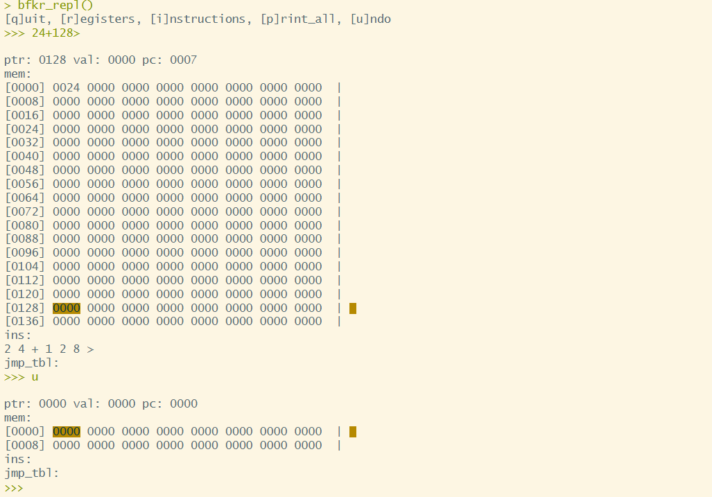
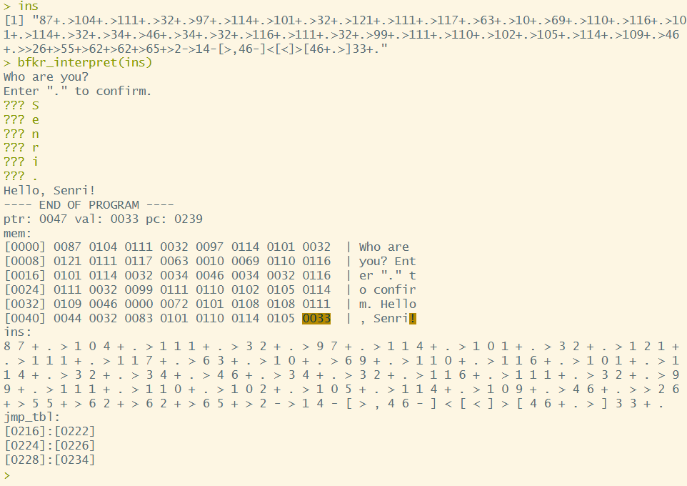
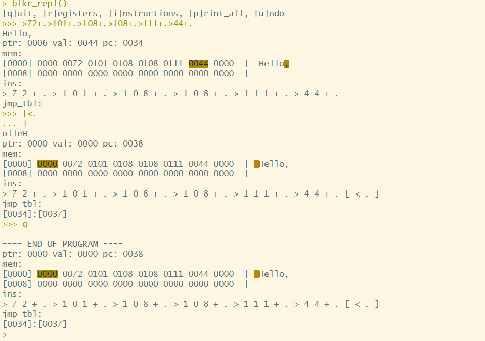

# Brainfkr

Interpreter and REPL for brainfk written in R.

## Features

-   Dynamic memory size
-   Undo at anytime
-   Repeat the same operator multiple times using a number prefix (except for `[` and `]`)
-   Automatically expands memory by 16 cells when needed
-   Each cell holds a value up to 256, with automatic wraparound on overflow



## Usage

To interpret brainfk code:

``` r
source("main.R")
code <- "your brainfk code goes here"
bfkr_interpret(code)
```



To enter REPL:

``` r
source("main.R")
bfkr_repl()
```


